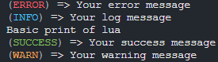

# Console

<details>
  <summary>Logs</summary>

  Added in **v0.1.0**
</details>

### Parameters

<table>
  <thead>
    <tr>
      <th width="151" align="center">Parameter</th>
      <th width="79" align="center">Type</th>
      <th align="center">Description</th>
    </tr>
  </thead>
  <tbody>
    <tr>
      <td>...args</td>
      <td align="center">any</td>
      <td></td>
    </tr>
  </tbody>
</table>

***

### Use


```lua
nlib.console.err('Your error message');
nlib.console.log('Your log message');
nlib.console.print('Basic print of lua');
nlib.console.success('Your success message');
nlib.console.warn('Your warning message');
```





Tips: **nlib.console** can be replaced by **console**.
