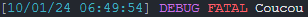

# Debug

<details>

<summary>Logs</summary>

Ajoutée en **v0.1.0**

</details>

### Appel


```lua
nlib.console.debug(eLevel, message);
```


***

### Paramètres

<table><thead><tr><th align="center">Paramètre</th><th width="79" align="center">Type</th><th align="center">Description</th></tr></thead><tbody><tr><td align="center">eLevel</td><td align="center">string</td><td align="center">Level d'erreur du debug</td></tr><tr><td align="center">message</td><td align="center">string</td><td align="center">Message de debug</td></tr></tbody></table>

***

### Utilisation


```lua
nlib.console.debug(nlib.enum.eLevel.Fatal, 'Coucou');
```


<div align="left" data-full-width="false">



</div>

